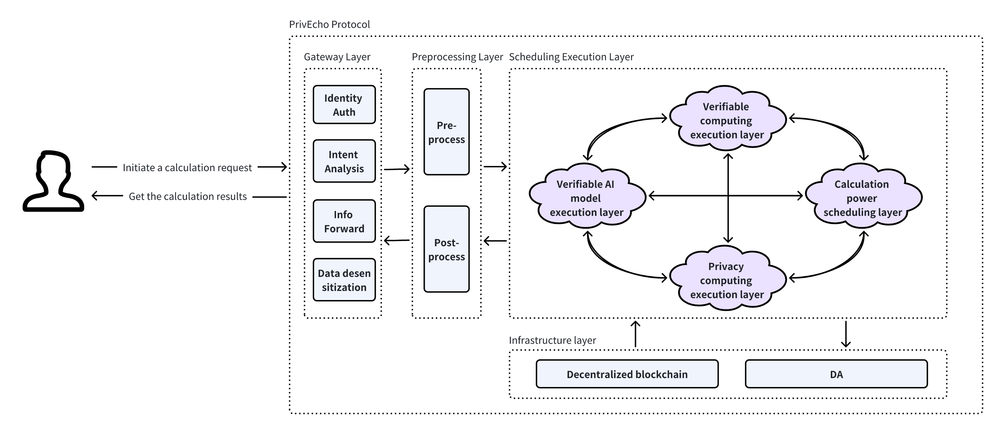

Process:
- The demand side pays the fee
- The demand side encrypts the original data
- The demand side uses cipertext to initiate a request
- PrivEcho schedules requests and generates zk certificates
- The demand side verifies the authenticity of the data